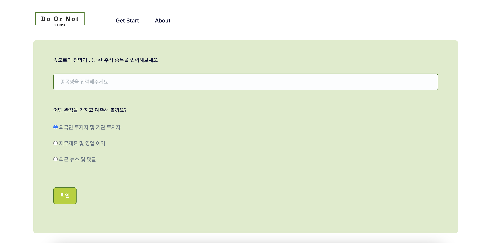

# Do Or Not

 

## **Used Stack**

---

Flask, HTML, CSS, Tailwind CSS, JS, Python  

 

## 세부 구현

---

### 사용자에게 입력 받은 주식 종목에 대해 AI의 전망 결과 출력

사용자에게 궁금한 주식종목 그리고 좀 더 중점적으로 살펴보고 싶은 관점을 입력 받습니다.

입력 받은 것을 토대로 질문을 생성하고 AI에게 질문하여 답변을 받으면 답변을 출력합니다.

사용 AI : https://bard.google.com/

 

### 사용자가 폼을 채우지 않을 시

사용자가 주식종목을 작성하지 않고 확인 버튼을 누른다면 종목을 채우라는 알림과 함께 넘어가지 않습니다.

 

### 결과 화면을 본 후 다시하고 싶을 때

결과 화면 밑 다시하기 버튼을 클릭하여 처음화면으로 돌아갈 수 있습니다.

 

### AI에게 질문 및 답변을 얻어오는 파일 및 환경 변수

AI 관련 처리는 bard_stocks.py 에서 진행하며, 환경 변수는 .env 파일에 저장하여 사용하였습니다.

참고 사이트: https://github.com/dsdanielpark/Bard-API